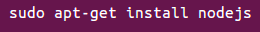
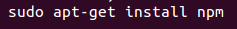
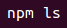
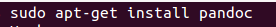
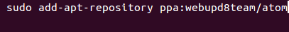
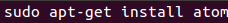

#**_Iniciándome en markdown_**#

###Instalación de node.js

_Node.js se ha instalado con el comando:_

_Se ha instalado el sistema de manejo de paquetes y gestión de módulos de node.js:_

_Para comprobar que npm funciona correctamente:_

###Instalación de pandoc

_Se ha procedido a la instalacion de pandoc:_

###Instalación de Atom

_Se han utilizado los siguientes comandos:_

